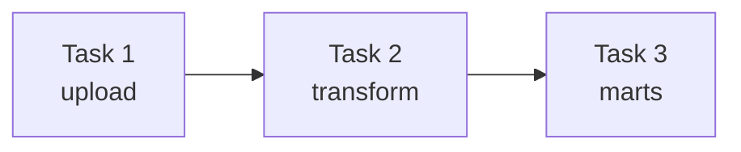
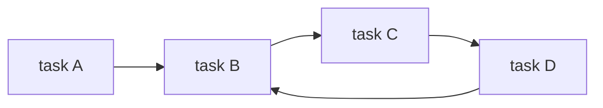

## Chapter 1. Meet Apache Airflow
Data pipeline is a collection of several tasks. There is a dependency among tasks exists. So what does it mean? If upstream tasks are completeled succesfully, the next downstream tasks can be executed right now. 

We can describe data pipeline as a graph, which nodes are tasks, and edges are the dependencies among tasks. 

There are 2 types of graph exists: Directed Cycled Graph(DCG) and Directed Acycled Graph(DAG).
DCG is a type of graph which tasks can be repeated as a cycled loop. for example:

Pipeline graphs vs sequential scrypts. Sometimes we write scrypts for data and ml pipelines with functions and classes. We may misunderstand the structure and dependency of tasks. But with graphs it is easy to understand them. 

There are a lot of tools and workflow managers exists to run pipelines, such as Argo, Dagster, NIfi, but the most famous tool is Apache Airflow. We will discuss more about it.
Aiflow is a open-source solution workflow manager to run pipelines and follow the task dependencies. There are 5 components of Airflow DAG. They show how Airflow works in the background:
1. DAG Processor => It analyzes DAGs, and store it to metadata.
2. Scheduler => It set for execution of DAG's tasks. With scheduler tasks can be executed daily, hourly, or with special intervals.
3. Workers => It picks up tasks for execution. They are responsible for execution and doing actual works.
4. Triggerer => It checks the completition of tasks and it supports asynchronic processing.
5. API Server => It provides to follow tasks and results in Airflow UI.

In Airflow UI you can see not only the DAGs, their tasks and dependencies, but also run times, logs, and if error exists, you can check with logs. In addition you can see dependencies as a graph, trigger dags, runtimes, etc.

Incremental load and backfilling. Incremental load means that you load only new data(for example today's transactions) to database. Backfilling means that when you trigger/enable a DAG, past intervals that were never executed (because the DAG didn't exist or wasn't active yet) get run retroactively.

Why Airflow? => You can run the tasks in a scheduled time and intervals, follow dependencies, and check the errors.

