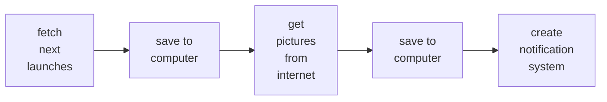

## Chapter 2. Anatomy of an Airflow DAG

I would like to begin this topic with a practical example. So John wants to get information about launchs of rocketts. So firstly he should fetch info about launchs with API, then load to his computer, after thet he should retrieve rocket pictures, load to his computer, and finally create a notification system that which rocket is planned to be launched for any time. 

We can follow processes like:

We can set 3 tasks for DAG like:
1. download_launches
2. get_pictures
3. notify

There are 3 ways to define a DAG:
1. Explicit definition: You set all tasks and define in their arguments which dags they are belong to. 

        dag1 = DAG(...)
        dag2 = DAG(...)
        task1 = PythonOperator(..,dag=dag1)
        task2 = BashOperator(..,dag=dag1)
        task3 = BashOperator(..,dag=dag2)

2. Context Manager: You define tasks in just DAGs. for ex:

        with DAG(...):
            task1 = PythonOperator(..)
            task2 = BashOperator(..)
            task3 = BashOperator(..)

3. Taskflow API. It works with decorators named @dag and @task

        @dag(
            start_date=datetime(2026, 1, 1),
            schedule="@daily",
            catchup=False,
            tags=["example"]
        )
        def my_etl_pipeline():

            @task
            def extract():
                return {"data": [1, 2, 3, 4, 5]}

            @task
            def transform(raw_data: dict):
                transformed_data = [x * 2 for x in raw_data["data"]]
                return transformed_data

            @task
            def load(processed_data: list):
                print(f"Successfully loaded data: {processed_data}")

Task dependency defined with bitwise rightshift operator (>>). If some tasks are run at the same time they definde in a brackets ([])

For ex: 

        task1 >> task2 >> [task3, task4] >> task5

In this example, task3 and task4 will be executed at the same time. 

How to handle failing tasks?
If a task is failed you can solve with clear task instance. There are some ways to solve failed tasks: so you can clear just failed task (it is more acceptable, because upstream tasks are already executed succesfully), just downstream tasks, and upstream and downstream tasks together.

Task vs Operator. Actually they are core components of DAGs, but the main difference is that Operator has a single duty. There are some main operators used in DAGs:
1. PythonOperator: Run Python codes
2. BashOperator: Run Bash Commands
3. EmailOperator: Send message on Email
4. OracleOperator: Execute SQL codes on Oracle

