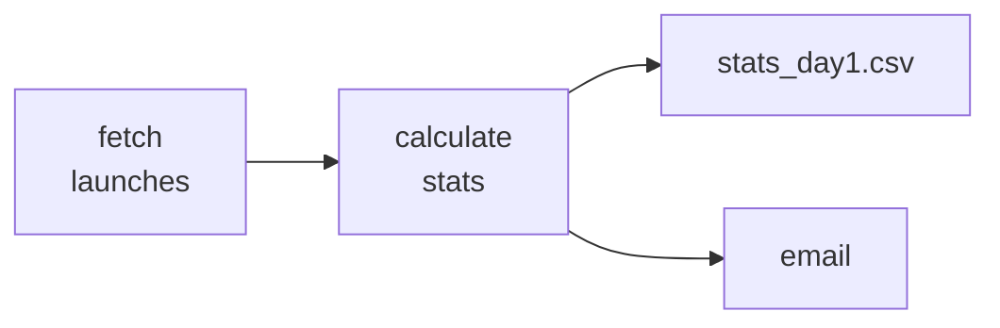

## Chapter 3. Time-based Scheduling

### Trigger based schedule
Airflow schedules are definde by four core components: start_date, end_date(optional), schedule, and catchup(optional).
schedule determine the time of task execution: By default a Dag doesn't have schedule(schedule=None), but there are some types of schedules exists: @daily, @hourly, @monthly, etc. In addition, we can define schedule with cron expression. Cron expression has 5 parts.


     *      *     *    *      *
    minute   hour  day  month  weekday(from 0 to 6, 0 is Sunday(7 is also Sunday))

For ex: 

        10 16 * * *     The DAG will be triggered at 16:10 every day.
        30 10,19 * * 0  The DAG will be triggered at 10:30 and 19:30 every Sunday
        * * 1 * *       The DAG will be triggered every 1st day of every month.

Backfilling is determined with catchup. catchup=True means that previous time execution will be retroactively run. catchup=False means that no backfilling happens — Airflow skips all past missed intervals and only runs the DAG starting from the most recent schedule interval going forward.

We can define a daily schedule with CronTriggerTimeTable which requires cron expression and time zone. 

For ex: 

        schedule = CronTriggerTimeTable(@daily, timezone="UTC") dag will be triggered daily in UTC timezone. 
        
        schedule = CronTriggerTimeTable(30 0 * * *, timezone="UTC") dag will be triggered at 00:30 everyday in UTC timezone.

But if you want to trigger just every 2 days of every month, such as Jan 1, Jan 3, Jan 5, and so on, it may give some problems in cron expression. So you can use frequency based schedule with pendulum.duration() with DeltaTriggerTimeTable.
For ex: 

    schedule = DeltaTriggerTimeTable(pendulum.duration(days=2))


### Interval-based Schedule

Trigger based schedule defines just single points, so in which points dag will be triggered. But interval based schedule allowing us to trigger dag in a given interval. In Airflow we use method CronDataIntervalTimeTable. Allright, Airflow has 2 extra components: data_interval_start, data_interval_end. What does it mean? We set start_date, end_date, and schedule, and based of them intervals are created. Every interval has data_interval_start and data_interval_end. DAG is run in every interval. let's clarify it with a simple example:

    schedule = CronDataIntervalTimeTable("@daily", timezzone = "UTC")
    start_date = pendulum.datetime(2024, 1, 1)
    end_date = pendulum.datetime(2024, 1, 4)

Intervals:     

        0      01.01 00:00        -     02.01 00:00

               02.01 00:00        -     03.01 00:00

               03.01 00:00        -     04.01 00:00
               
            (data_interval_start)    (data_interval_end)

let's take 1st interval. A DAG will be triggered at 02.01 00:00. But it will bring data from 01.01 00:00 to 02.01 00:00
BUt the last moment will be 01.01 23:59

We can set interval-based schedule using frequency. For it we use DeltaIntervalTimeTable. For example if we want to trigger DAG every 1st, 3rd, 5th days of every month we can apply frequency

    example: schedule = DeltaIntervalTimeTable(pendulum.duration(days=2))


If you want to trigger only in specific dates, you should use Eventtimetable. 
for example:

```
exam_dates = EventsTimeTable(
    event_dates = [
        pendulum.datetime(year=2026, month=2, day=15),
        pendulum.datetime(year=2026, month=5, day=17),
        pendulum.datetime(year=2026, month=6, day=14)
    ],
    restrict_to_events=True)
with DAG(
    dag_id = "exam"
    schedule=exam_dates
    start_date=datetime(2026,2,15)
)
```
Note: restrict_to_events = True means that while triggering the dag, a system will accept the last date of events, but if it equals to False, a system will accept a date you triggered the dag for the last time.

max_active_tasks means that maximum how many paralel task instances  can be run. Default number is 16. 
max_active_runs means that maximum how many dags can be run actively. Default number is 16. When maximum is reached, it will not create a new dag until previous one is stopped. 

### Atomicity

It means that everything happens or nothing happens. Every work of task should be completed fully. for example, let's clarify it with a simple graph:


So you can see that in 2nd task both file and email should be sent successfully. If we get csv file but there is no email, it means that there is no atomicity. 

So how to solve it? You can break a single task into multiple tasks to safe atomicity. 

### Idempotency

It means that if you run DAG twice, you should get the same result without getting duplicates.