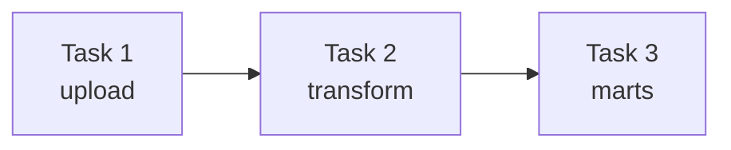
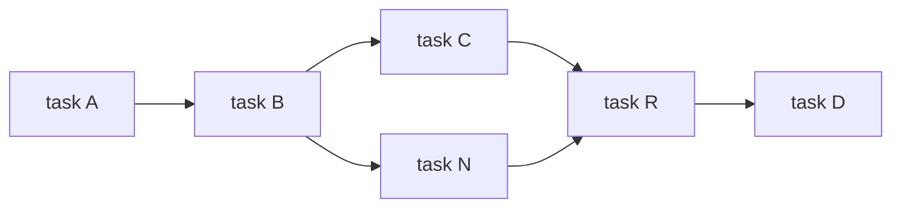

## Chapter 6. Defining dependencies between tasks.

### Dependencies
In DAG, there is a dependency between upstream and downstream tasks. Dependency can be successful and all tasks can be completed only when there is no error in tasks and network failure. 
There are 2 types of dependencies:
#### Linear Dependency 

This is a simple dependency between single tasks. 

Example: 



In this example you can see that Task 2 can be executed only when Task 1 is executed with no error.
#### Fan in/ Fan out dependency

In this dependency, some tasks may be run in paralel. 
Example:


As you can see, after successful completition of Task B, task C and N are running in paralel. Task R can be executed only when both task C and N are run with no errors. 

### Branching

Sometimes, calculation method or ERP system may be changed. So we need to write 2 separate tasks for each method. But in Airflow we can use branching instead of writing multiple similar task with a different condition. There are 2 types of branching:

1. Branching within tasks

We can give 2 different method in 1 task. And then we can run with PythonOperator.

Python code

```python
def _clean_sales(**context):  
    if context["data_interval_start"] < ERP_CHANGE_DATE:
        _clean_sales_old(**context)
    else
        _clean_sales_new(**context)
...
clean_sales_data = PythonOperator(
    task_id="clean_sales",
    python_callable=_clean_sales,
)
```

As you can see that in a task we gave 2 statement. For data before ERP_CHANGE_DATE we use old cleaning method, but for data after changing we use new cleaning method. 

2. Branching within the DAG

Instead of branching within tasks, we can also branching within the DAG. It is a bit more simple. Because when you visualize the DAG, you can't see in which task we verified these statements, you should look at the codes of tasks. But while branching within the DAG, you can see in a visualized graph. 
How to branch them? 
Let's continue with ERP example. We add 1 more task named pick ERP system. After it, we add 2 separate task for each method. But we should connect them. Fortunately, we can do it with BranchOperator. 
Python example:

```python

```

### Conditional Tasks

### Trigger Rules

### Sharing data between tasks

### Chaining Python tasks with the Tsskflow API

