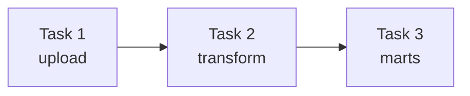
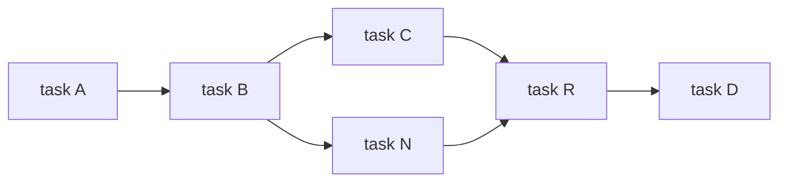

## Chapter 6. Defining dependencies between tasks.

### Dependencies
In DAG, there is a dependency between upstream and downstream tasks. Dependency can be successful and all tasks can be completed only when there is no error in tasks and network failure. 
There are 2 types of dependencies:
#### Linear Dependency 

This is a simple dependency between single tasks. 

Example: 



In this example you can see that Task 2 can be executed only when Task 1 is executed with no error.
#### Fan in/ Fan out dependency

In this dependency, some tasks may be run in paralel. 
Example:


As you can see, after successful completition of Task B, task C and N are running in paralel. Task R can be executed only when both task C and N are run with no errors. 

### Branching

Sometimes, calculation method or ERP system may be changed. So we need to write 2 separate tasks for each method. But in Airflow we can use branching instead of writing multiple similar task with a different condition. There are 2 types of branching:

1. Branching within tasks

We can give 2 different method in 1 task. And then we can run with PythonOperator.

Python code

```python
def _clean_sales(**context):  
    if context["data_interval_start"] < ERP_CHANGE_DATE:
        _clean_sales_old(**context)
    else
        _clean_sales_new(**context)
...
clean_sales_data = PythonOperator(
    task_id="clean_sales",
    python_callable=_clean_sales,
)
```

As you can see that in a task we gave 2 statement. For data before ERP_CHANGE_DATE we use old cleaning method, but for data after changing we use new cleaning method. 

2. Branching within the DAG

Instead of branching within tasks, we can also branching within the DAG. It is a bit more simple. Because when you visualize the DAG, you can't see in which task we verified these statements, you should look at the codes of tasks. But while branching within the DAG, you can see in a visualized graph. 
How to branch them? 
Let's continue with ERP example. We add 1 more task named pick ERP system. After it, we add 2 separate task for each method. But we should connect them. 

```python
fetch_sales_old = PythonOperator(...)
clean_sales_old = PythonOperator(...)
fetch_sales_new = PythonOperator(...)
clean_sales_new = PythonOperator(...)
fetch_sales_old >> clean_sales_old
fetch_sales_new >> clean_sales_new
```

Fortunately, we can do it with BranchOperator. BranchOperator will return the Task ID which will be run. 
Python example:

```python
def _pick_erp_system(**context):
    if context["data_interval_start "] < ERP_CHANGE_DATE:
        return "fetch_sales_old"
    else:
        return "fetch_sales_new"
pick_erp_system = BranchPythonOperator(
    task_id="pick_erp_system",
    python_callable=_pick_erp_system,
)
pick_erp_system >> [fetch_sales_old, fetch_sales_new]
```
Then we will connect with join_datasets:
```
[clean_sales_old, clean_sales_new] >> join_datasets
```
But we forgot one fact. In default, all tasks are executed successfully based on trigger_rule=all_success. Based on statement, one of the tasks will be executed, so join_datasets will be skipped. To solve it, you should add one empty task with EmptyOperator before joining datasets and change trigger_rule to none_failed, so none of these tasks will be failed. 

```python
from airflow.providers.standard.operators.empty import EmptyOperator
join_branch = EmptyOperator(
    task_id="join_erp_branch",
    trigger_rule="none_failed"
)
[clean_sales_old, clean_sales_new] >> join_branch
join_branch >> join_datasets
```

### Conditional Tasks

Imagine that you want to change entire code and use backfilling. We need just deploy model for only recent dataset, If backfilling triggers the DAG for old data intervals, we don't want to retrain and redeploy the model for every one of them — we only want to deploy it for the most recent dataset. You will check between current run's end and next run's end time. If there is no next scheduled run ( this is the last scheduled execution), the model is deployed. So, how to do it?
1. Conditional within the task. We can check entire the task, but in graph you can't see in which case it would be skipped. 

```python
def _deploy_model(dag, data_interval_start, data_interval_end, **_):
    task_exec_start = pendulum.now("UTC")
    time_restriction = TimeRestriction(earliest=None, latest=None, 
catchup=True)
    current_interval = DataInterval(start=data_interval_start, end=data_
interval_end)
    next_info = dag.timetable.next_dagrun_info(
                last_automated_data_interval=current_interval,
                restriction=time_restriction,
            )
    if next_info is None:
        # Last scheduled execution
        return True
    next_info_start, next_info_end = next_info.data_interval
    if next_info_start < task_exec_start <= next_info_end:
        print("Deploying model")
```

2. Making tasks conditional. You add AirflowSkipException to skip task in case of non-recent execution.

```python
from airflow.exceptions import AirflowSkipException
from airflow.timetables.base import DataInterval, TimeRestriction
def _latest_only(dag, data_interval_start, data_interval_end, **_):
    task_exec_start = pendulum.now("UTC")
    time_restriction = TimeRestriction(
        earliest=None,
        latest=None,
        catchup=True
    )
    current_interval = DataInterval(
        start=data_interval_start,
        end=data_interval_end
    )
    next_info = dag.timetable.next_dagrun_info(
                last_automated_data_interval=current_interval,
                restriction=time_restriction,
            )                                                    
    if next_info is None:
        # Last scheduled execution
        return True
    next_info_start, next_info_end = next_info.data_interval
    if not next_info_start < task_exec_start <= next_info_end:   
        raise AirflowSkipException("Not the most recent run!")  
```

3. Using built-in operators. It is more simple way to make tasks conditional. You just add task with LatestOnlyOperator, which checks there is recent run or not. 

```python
from airflow.providers.standard.operators.latest_only import LatestOnlyOperator
latest_only = LatestOnlyOperator(
    task_id="latest_only",
)
train_model >> latest_only >> deploy_model
```

### Trigger Rules

Trigger rule allows you to execute tasks and trigger DAG based on some rules. In default, the trigger rule is all_success, even if you don't set any trigger rule, all task will be executed with rule "all_success"(all tasks should be run successfully). 
Upstream tasks' failure or success affect downstream tasks, this is called propagation.

Table 6.1 Overview of the trigger rules Airflow supports

| Trigger rule | Behavior | Example use case |
|---|---|---|
| all_success (default) | Triggers when all parent tasks have completed successfully | The default trigger rule for a normal workflow |
| all_failed | Triggers when all parent tasks have failed (or failed as a result of a failure in their parents) | Triggers error-handling code to clean up temporary resource or aid in alert-ing scenarios |
| all_done | Triggers when all parents are done executing, regardless of the resulting state | Executes cleanup code that you want to execute when all tasks have finished (e.g., shutting down a machine or stop-ping a cluster) |
| all_done_setup_success | Triggers when all setup tasks have succeeded and all other upstream tasks are done | Is configured automatically for tear-down tasks; you wouldn't set this rule yourself |
| all_skipped | Triggers when all parent tasks have been skipped | Executes code that would replace the logic of skipped upstream tasks |
| one_failed | Triggers as soon as at least one parent fails; doesn't wait for other parent tasks to finish executing | Quickly triggers some error-handling code, such as notifications or rollbacks |
| one_success | Triggers as soon as one parent suc-ceeds; doesn't wait for other parent tasks to finish executing | Quickly triggers downstream computations/notifications as soon as one result becomes available |
| one_done | Triggers if at least one upstream task succeeds or fails | Quickly continues with the DAG logic when one task completes execution, whether that task succeeded or failed |
| none_failed | Triggers if no parents failed but were completed successfully or skipped | Joins conditional branches in Airflow DAGs (section 6.2) |
| none_failed_min_one_success | Triggers when upstream tasks have not failed (they could have been skipped) but at least one upstream task has succeeded | Joins conditional branches in Airflow DAGs  |
| none_skipped | Triggers if no parents have been skipped but have completed success-fully or failed | Triggers a task if all upstream tasks were executed, ignoring their result(s) |
| always | Triggers regardless of the state of any upstream tasks | Performs testing |

### Sharing data between tasks(XComs)

XComs(cross-communication). It allows you to share a small data, such as string, number, a small list/dict between tasks. There are some ways of using XCom exists:
1. Use XCom within task. Push and Pull

```python
def _train_model(**context):
    model_id = str(uuid.uuid4())
    context["task_instance"].xcom_push(key="model_id", value=model_id)


def _deploy_model(**context):
    model_id = context["task_instance"].xcom_pull(task_ids="train_model", key="model_id")
    print(f"Deploying model {model_id}")
```

2. Return method and then pull

```python
def _train_model(**context):
    model_id = str(uuid.uuid4())
    return model_id
```

3. XCom template

```python
def _train_model(**context):
    model_id = str(uuid.uuid4())
    context["task_instance"].xcom_push(key="model_id", value=model_id)


def _deploy_model(templates_dict, **context):
    model_id = templates_dict["model_id"]
    print(f"Deploying model {model_id}")

......

    train_model = PythonOperator(task_id="train_model", python_callable=_train_model)

    deploy_model = PythonOperator(
        task_id="deploy_model",
        python_callable=_deploy_model,
        templates_dict={"model_id": "{{task_instance.xcom_pull(task_ids='train_model', key='model_id')}}"},
    )
```

4. Using XCom backends

```python
from typing import Any
from airflow.sdk.bases.xcomimport BaseXCom
class CustomXComBackend(BaseXCom):
    @staticmethod
    def serialize_value(value: Any):
        ...
    @staticmethod
    def deserialize_value(result) -> Any:
```

serialize => push
deserialize => pull

#### When you should/shouldn't use XCom?

Use XCom if:
1. Data is small — a string, number, single row, etc.
2. You share data between tasks within a single DAG.
3. The result affects how the next task behaves (e.g., branching decision).

Don't use XCom if:
1. Data is large (e.g., a dataset, asset, many rows, a CSV file). Instead, upload the data to storage (e.g., S3) and pass only the reference/path via XCom.
2. You're only setting task order, with no data to pass — use >> / << instead.
3. Data is sensitive — use Airflow Connections or a Secrets Backend instead.
4. You need to share data between DAGs — use TriggerDagRunOperator, Datasets/Assets, or ExternalTaskSensor.
5. Splitting a single logical operation across tasks connected by XCom risks partial failure (e.g., task 1 fetches data successfully, but task 2 fails) — consider whether it should be one atomic task instead.

### Chaining Python tasks with the Taskflow API

You can define tasks with @task decorator. It simplify code, you don't need to write all operators. 
You can use just @task decorator, and @task decorator and operator together. In addition you can define DAGs with @dag decorator.

```python
...
from airflow.sdk import task
...
with DAG(...):
    ...
    @task
    def train_model():
        model_id = str(uuid.uuid4())
        return model_id
```

```python
import uuid
from airflow.sdk import task, dag
@dag(  
    start_date=...,
    schedule=...,
)
def taskflow_api_decorator():  
    @task  
    def train_model():
        model_id = str(uuid.uuid4())
        return model_id
    @task  
    def deploy_model(model_id: str):
        print(f"Deploying model {model_id}")
    model_id = train_model()
    deploy_model(model_id)  
taskflow_api_decorator()  
```
