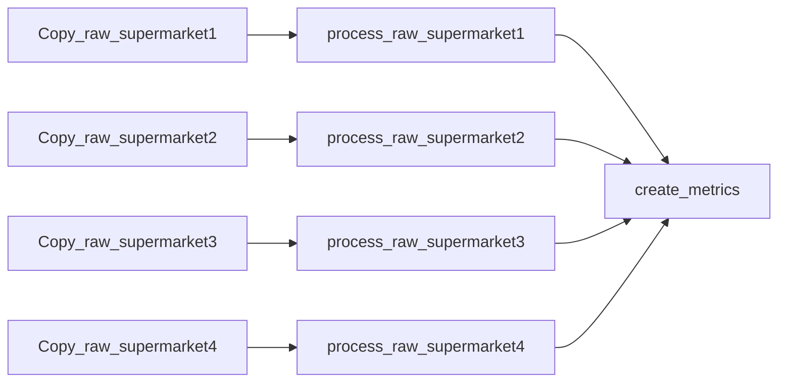
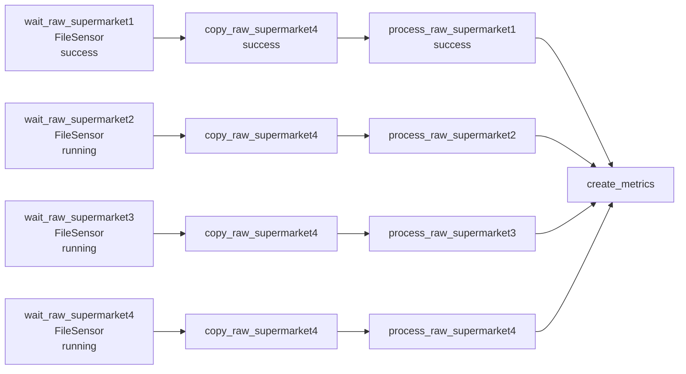

## Triggering workflows with external input

### Polling conditions with sensors.

Imagine that there are 4 supermarkets and a data analyst wants to analyze all 4 supermarkets' sales. So, data of every supermarket is required. The architecture will be as following:

But, data is arrived in different time. For example, supermarket1 at 4pm, supermarket2 at 5pm , supermarket3 at half past 6, and supermarket4 at 9pm. And workflow is executing at 10pm. So, you should you FileSensor. It checks that data is exists or not. If exists, state will be return as True and workflow will work, in contrast, it will return False and will wait for data for any give time.
But workflow wait for all data for a long time, so we can start workflow before poking for the availability of given files. 

#### Polling custom conditions

