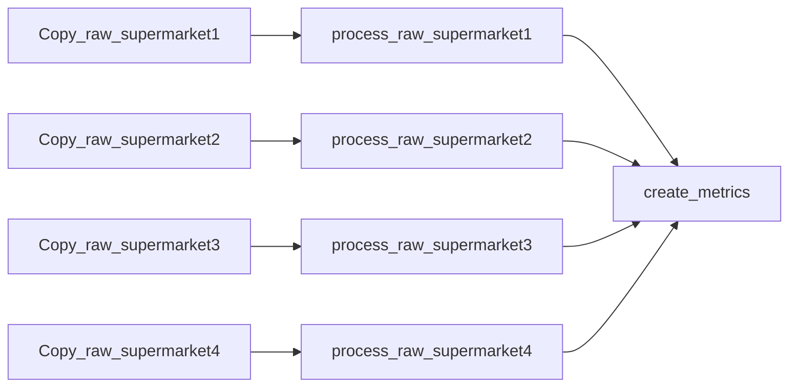
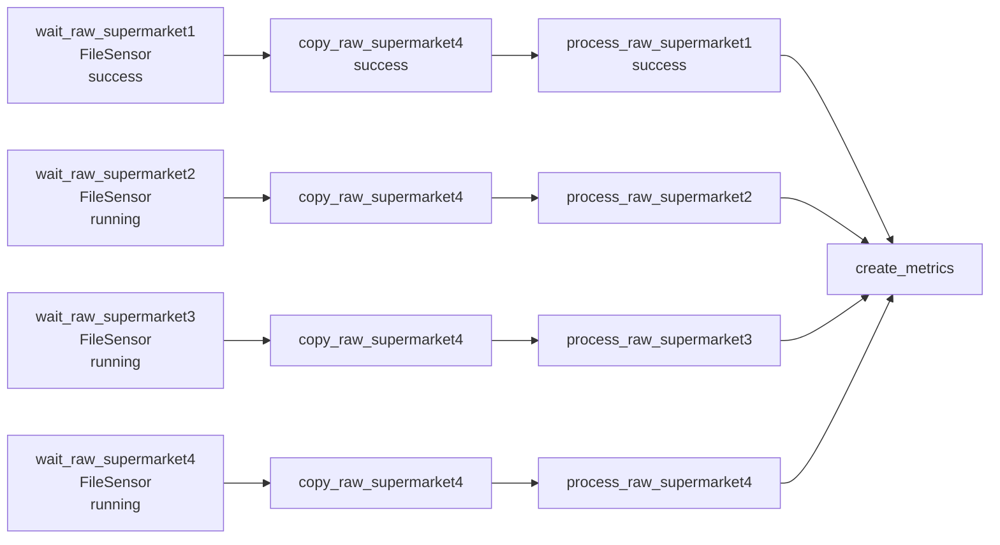

## Triggering workflows with external input

### Polling conditions with sensors.

Imagine that there are 4 supermarkets and a data analyst wants to analyze all 4 supermarkets' sales. So, data of every supermarket is required. The architecture will be as following:


But, data is arrived in different time. For example, supermarket1 at 4pm, supermarket2 at 5pm , supermarket3 at half past 6, and supermarket4 at 9pm. And workflow is executing at 10pm. So, you should you FileSensor. It checks that data is exists or not. If exists, state will be return as True and workflow will work, in contrast, it will return False and will wait for data for any give time.
But workflow wait for all data for a long time, so we can start workflow before poking for the availability of given files. 


#### Polling custom conditions.

You can check availability of file not only with FileSensor, but also with PythonSensor. PythonSensor executes a custom Python callable function repeatedly until it returns.

```python
from pathlib import Path
from datetime import timedelta
from airflow.providers.standard.sensors.python import PythonSensor
def _wait_for_supermarket(supermarket_id):
   supermarket_path = Path("/data/" + supermarket_id)   
   data_files = supermarket_path.glob("data-*.csv")     
   success_file = supermarket_path / "_SUCCESS"         
   return data_files and success_file.exists()          
wait_for_supermarket_1 = PythonSensor(
   task_id="wait_for_supermarket_1",
   python_callable=_wait_for_supermarket,
   op_kwargs={"supermarket_id": "supermarket1"},
   timeout=timedelta(minutes=5), 
)
```

#### Working with sensors outside the happy flow

Let's continue with the same example. So while triggering the DAG you rerun the tasks, poke the files, all slots are full, even if there is no work in a task, or anything is running. So, worker is failed and the next tasks can't run.
So, you not only poke the tasks, but also reschedule them. What does reschedule do? When any tasks wait for files, slots are free. 
Another way to solve is using deferable operators. Standard operators are synchronic, so even if there is no work, all slots are busy. But deferable operators frees the slots while  the job is running and being polled for its status, after polling, the worker slot can be reallocated to the deferrable operator task to complete the work.

#### Starting workflows with the REST API and CLI


