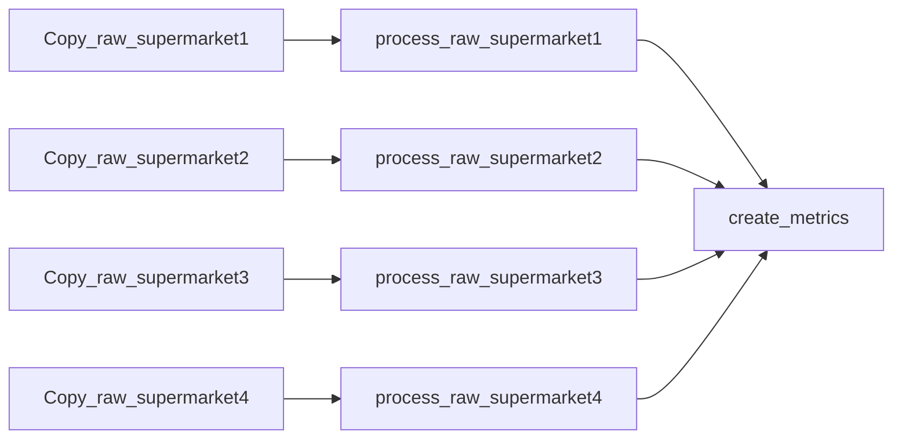
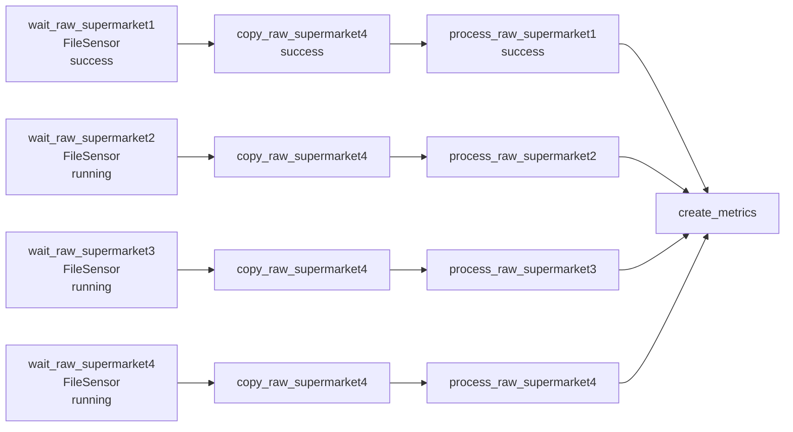

## Triggering workflows with external input

### Polling conditions with sensors.

Imagine that there are 4 supermarkets and a data analyst wants to analyze all 4 supermarkets' sales. So, data of every supermarket is required. The architecture will be as following:


But, data is arrived in different time. For example, supermarket1 at 4pm, supermarket2 at 5pm , supermarket3 at half past 6, and supermarket4 at 9pm. And workflow is executing at 10pm. So, you should you FileSensor. It checks that data is exists or not. If exists, state will be return as True and workflow will work, in contrast, it will return False and will wait for data for any give time.
But workflow wait for all data for a long time, so we can start workflow before poking for the availability of given files. 


#### Polling custom conditions.

You can check availability of file not only with FileSensor, but also with PythonSensor. PythonSensor executes a custom Python callable function repeatedly until it returns.

```python
from pathlib import Path
from datetime import timedelta
from airflow.providers.standard.sensors.python import PythonSensor
def _wait_for_supermarket(supermarket_id):
   supermarket_path = Path("/data/" + supermarket_id)   
   data_files = supermarket_path.glob("data-*.csv")     
   success_file = supermarket_path / "_SUCCESS"         
   return data_files and success_file.exists()          
wait_for_supermarket_1 = PythonSensor(
   task_id="wait_for_supermarket_1",
   python_callable=_wait_for_supermarket,
   op_kwargs={"supermarket_id": "supermarket1"},
   timeout=timedelta(minutes=5), 
)
```

#### Working with sensors outside the happy flow

Let's continue with the same example. So while triggering the DAG you rerun the tasks, poke the files, all slots are full, even if there is no work in a task, or anything is running. So, worker is failed and the next tasks can't run.
So, you not only poke the tasks, but also reschedule them. What does reschedule do? When any tasks wait for files, slots are free. 
Another way to solve is using deferable operators. Standard operators are synchronic, so even if there is no work, all slots are busy. But deferable operators frees the slots while  the job is running and being polled for its status, after polling, the worker slot can be reallocated to the deferrable operator task to complete the work.

#### Starting workflows with the REST API and CLI

You can also trigger the DAGs via REST API and CLI(Command-Line Interface). Instead of triggering manual in Airflow UI, you write command in the terminal(CLI).

```bash
airflow dags trigger dag1
```
You can also trigger with spesific configuration:

```bash
airflow dags trigger -c '{"supermarket_id" : 1}' dag1
```
```bash
airflow dags trigger ---conf '{"supermarket_id": 1}' dag1
```

You can also configurate in python script:

```python
import pendulum
from airflow.sdk import DAG
from airflow.providers.standard.operators.python import PythonOperator
def print_conf(**context):
   print(context["dag_run"].conf)   
with DAG(
    dag_id="11_inspect_dag_run_config",
    start_date=pendulum.today("UTC").add(days=-3),
    schedule=None,
):
process = PythonOperator(
    task_id="process",
    python_callable=print_conf,
)
```

So, tasks will print all information of conf:

```
...
{task_command.py:423} INFO - Running <TaskInstance:
➥ 19_inspect_dag_run_configuration.process
➥ manual__2024-04-20T07:11:47+00:00 [running]> on host
➥ aa69e3a53421
{logging_mixin.py:188} INFO - {'supermarket_id': 1}
{python.py:201} INFO - Done. Returned value was: None
(taskinstance.py:1138} INFO - Marking task as SUCCESS.
➥ dag_id=11_inspect_dag_run_configuration, task_id=process,
➥ execution_date=20240420T071147, start_date=20240420T071149,
➥ end_date=20240420T071149
{local_task_job_runner.py:234} INFO - Task exited with return code 0
{taskinstance.py:3281} INFO - 0 downstream tasks scheduled from
➥ follow-on schedule check
```
How to trigger the DAG via REST API? You don't send username and password, you just add your Airflow API authentication with airflow:airflow\ and send your request with POST command. Then you add configuration as dictionary(conf).

```bash
curl \-u airflow:airflow \-X POST \
"http://localhost:8080/api/v1/dags/11_inspect_dag_run_config/dagRuns" \-H  "Content-Type: application/json" \-d '{"conf": {"supermarket": 1}}'
{
}
  "conf": {
    "supermarket_id": 1
  },
  "dag_id": "11_inspect_dag_run_config",
  "dag_run_id": "manual__2024-04-20T08:10:46.623540+00:00",
  "data_interval_end": "2024-04-20T00:00:00+00:00",
  "data_interval_start": "2024-04-19T00:00:00+00:00",
  "end_date": null,
  "execution_date": "2024-04-20T08:10:46.623540+00:00",
  "external_trigger": true,
  "last_scheduling_decision": null,
  "logical_date": "2024-04-20T08:10:46.623540+00:00",
  "note": null,
  "run_type": "manual",
  "start_date": null,
  "state": "running"
```

#### Triggering workflows with messages

You can also check the existency of file, new bank transactions with send message on Kafka.

```python
from airflow.providers.common.messaging.triggers.msg_queue import MessageQueueTrigger
trigger = MessageQueueTrigger(
    queue="kafka://kafka:9092/events", 
    apply_function="custom.kafka_util.apply_function", 
)
```
apply_function is used to define and trigger the DAG. With this function you can get spesific messages, not all the messages necessary or unnecessary. You can filter them.

You can define the Asset with MessageQueueTrigger.

```python
from airflow.sdk import Asset, AssetWatcher
asset = Asset("kafka_queue_asset", watchers=[
AssetWatcher(name="kafka_watcher", trigger=trigger)
])
```
After triggering the DAG, in Kafka CLI run this command:

```bash
$ /opt/kafka/bin/kafka-console-producer.sh --bootstrap-server kafka:9092 --topic events
>
```
When the > appears, type something and press "Enter". A message will be send to Kafka topic. 


